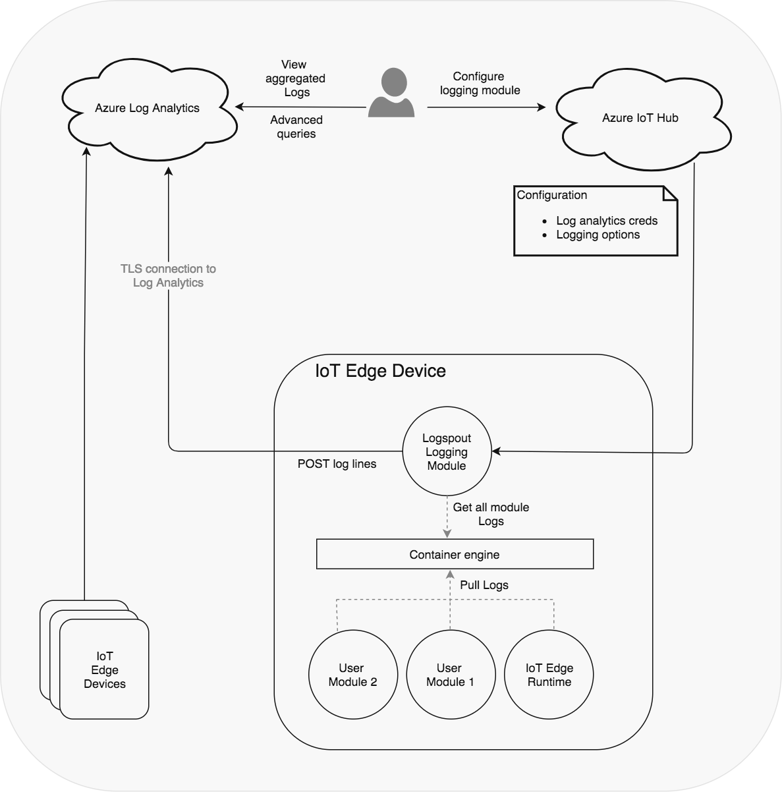
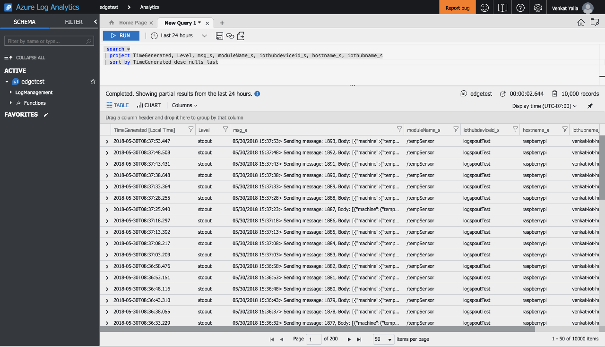
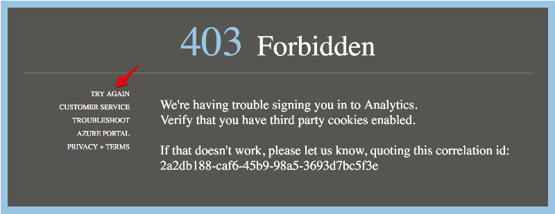

# logspout-loganalytics
This repository provides an [Azure IoT Edge](https://azure.microsoft.com/en-us/services/iot-edge/)
module that can be used to send container logs from other modules on the edge device, including the
edge runtime, securely to [Azure Log Analytics](https://docs.microsoft.com/en-us/azure/log-analytics/)
in the cloud. With minimal changes to the edge deployment, logs from multiple edge devices can be
directed to a single log analytics workspace. This allows you to get a consolidated view of logs from
all your edge devices which can be analyzed using a powerful search mechanism to discern 
operational patterns or debug failures.

# Architecture
This module leverages [gliderlabs/logspout](https://github.com/gliderlabs/logspout) project, for which it provides a custom loganalytics adapter that sends container logs obtained by logspout to Azure Log Analytics service. Log analytics credential and logging options can be specified in the module configuration from IoT hub.



## Available platforms
* linux/amd64
* linux/arm64
* linux/386
* linux/arm/v7

# Getting started
You'll need to create a log analytics workspace, configure the log module in IoT hub with required settings and you should be good to go!

## Create a Log Analytics workspace
Follow the Log Analytics documentation to [create a workspace](https://docs.microsoft.com/en-us/azure/log-analytics/log-analytics-quick-collect-linux-computer#create-a-workspace) and [obtain the workspace ID and key](https://docs.microsoft.com/en-us/azure/log-analytics/log-analytics-quick-collect-linux-computer#obtain-workspace-id-and-key). Take note of the workspace ID and key as they are required in the next step.

## Configure the logging module in IoT hub
Next, we'll [deploy an IoT edge module](https://docs.microsoft.com/en-us/azure/iot-edge/tutorial-simulate-device-linux#deploy-a-module) for logging. 

Here are the values and steps for logging module creation:
1. In the **Name** field, enter the logging module name of your choice e.g. ```logspout```
1. In the **Image URI** field, enter
    * ```kbeaugrand/logspout-loganalytics``` for platforms listed above.
    * Windows is not supported yet.
1. In the **Container Create Options** field, enter
    ```
    {
        "Env": [
            "BACKLOG=false",
            "LOGSPOUT=ignore",
            "LOGANALYTICS_WORKSPACE_ID=<replace-with-loganalytics-workspace-id>",
            "LOGANALYTICS_WORKSPACE_SECRET=<replace-with-workspace-key>"
        ],
        "Cmd": [
            "loganalytics://"
        ],
        "HostConfig": {
            "Binds": [
                "/var/run/docker.sock:/var/run/docker.sock"
            ]
        }
    }
1. Leave the other settings unchanged, and select **Save**.
1. Back in the **Add Modules** step, select **Next**.
1. In the **Specify Routes** step, select **Next**.
1. In the **Review template** step, select **Submit**.

Thats it! You don't have to change any configuration for other modules or install any services or agents on the edge device to start pushing module logs to the cloud. The logspout-loganalytics module is self-contained.

## Viewing module logs in Log Analytics
>Logs emitted on the device usually show up in log analytics portal in 5 minutes.

Navigate to the [Log search / Advanced analytics portal](https://docs.microsoft.com/en-us/azure/log-analytics/log-analytics-log-search-portals) to search or query logs from your edge devices. Advanced analytics portal is more user friendly.

Enter the following search query to view logs from all devices sorted by time generated.

```
 search *
| project TimeGenerated, Level, msg_s, moduleName_s, iothubdeviceid_s, hostname_s, iothubname_s
| sort by TimeGenerated desc nulls last
```

Here is a sample screenshot of the output:




# Sample queries on edge logs
Checkout [the sample queries page](sample-queries.md).

# FAQ
See the [FAQ page](faq.md).

# Known issues
* If the time on the edge device is out of sync it fails to establish a secure TLS connection with Log analytics endpoint. Consider using NTP daemon to keep the time on the device synchronized (especially when testing in a VM).

* The [Advanced analytics portal](https://docs.microsoft.com/en-us/azure/log-analytics/log-analytics-log-search-portals#advanced-analytics-portal) only works when opened from the [Log search](https://docs.microsoft.com/en-us/azure/log-analytics/log-analytics-log-search-portals#log-search) pane inside the Azure Portal. If it times out, close the Advanced analytics portal and re-open from Log search pane. Sometimes this shows a **403 Forbidden** error code. Clicking the **Try Again** link helps fix the issue (sometimes).

    

# Acknowledgements

* https://github.com/yangl900/log2oms
* https://github.com/KTH/logspout-oms
